# perception_for_robotics

There are 3 packages in this repository:
- "coordinate_transforms_and_feature_projections"
- "feature_point_detection_and_correspondences"
- "3D_object_detection_and_instance_segmentation"

## Package - "coordinate_transforms_and_feature_projections"

### LiDAR range measurments transformed to camera frame and projected on image
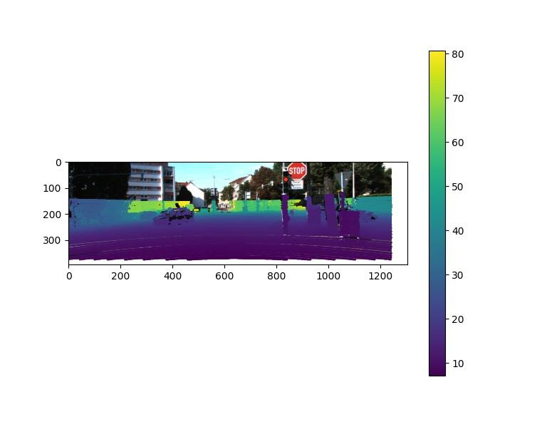

## Package - "feature_point_detection_and_correspondences"

### SIFT keypoint matches between left and right stereo images after RANSAC outlier rejection
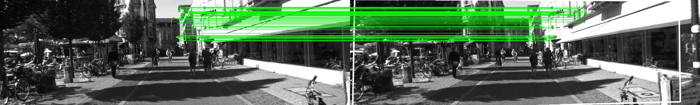
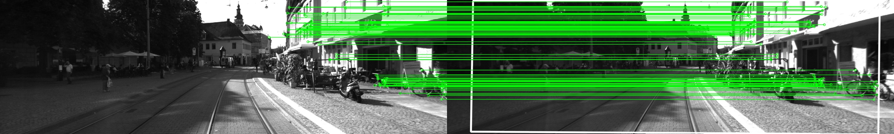
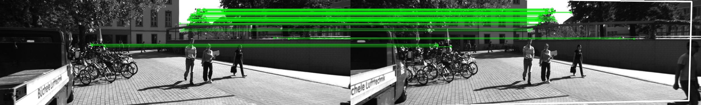
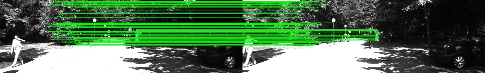
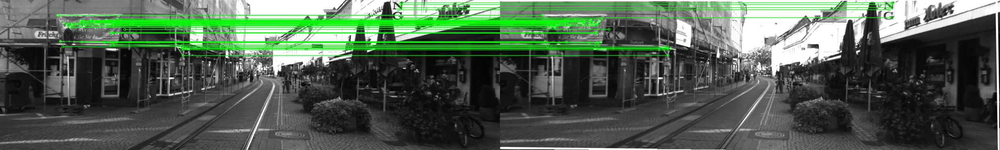

## Package - "3D_object_detection_and_instance_segmentation"

### Estimated depth using provided disparity maps between left and right stereo images
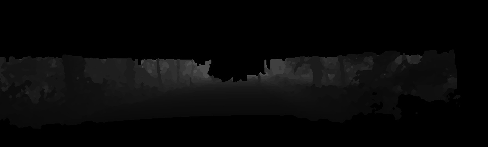
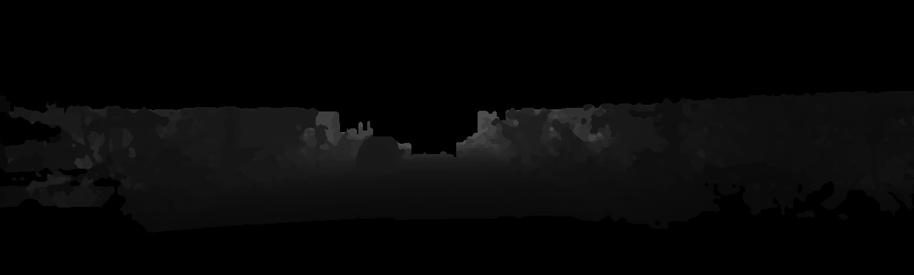
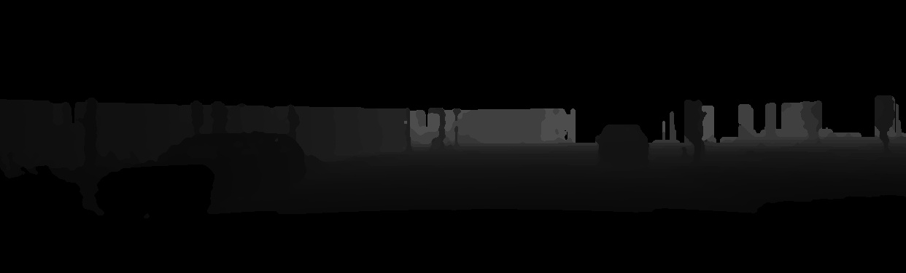
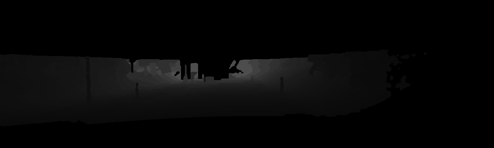
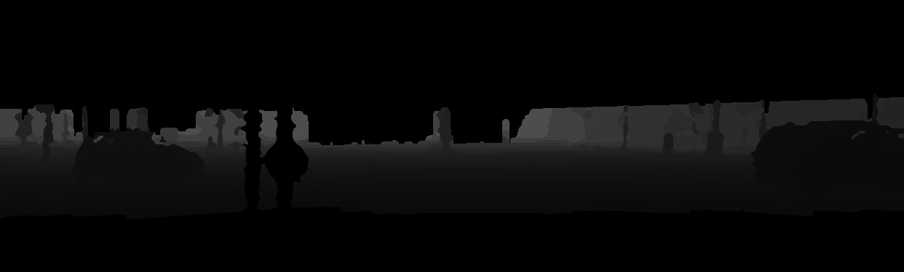

### Bounding boxes around cars in left images using YOLOv3

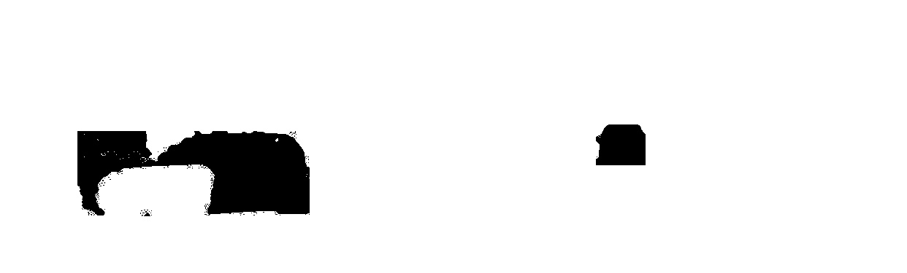

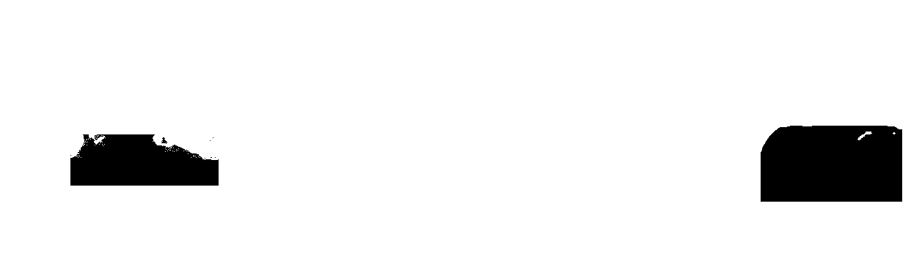

### Instance segmentation on left stereo images for every detected car
